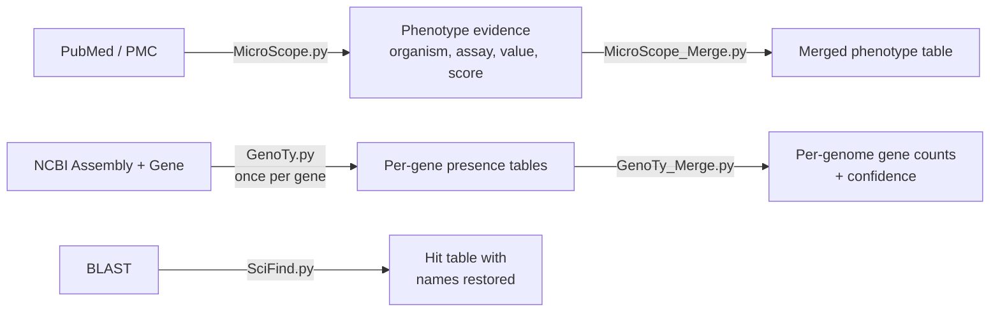

# BactHarvest
 
**Harvesting bacterial trait evidence from NCBI.**
 
BactHarvest is a toolkit of three independent command-line programs for
building evidence-backed datasets of bacterial functional traits. Each one
queries a different part of NCBI and answers a different question:
 
| Tool | Question it answers | NCBI resource |
|---|---|---|
| **MicroScope** | Which organisms were *experimentally shown* to perform a phenotype, by what assay, at what measured value? | PubMed / PMC |
| **GenoTy** | Which genomes carry a given marker gene? | Assembly / Gene |
| **SciFind** | What organism does this tax ID belong to? (restores missing names in BLAST output) | Taxonomy |
 
The tools are not a fixed pipeline. Each takes its target (a phenotype, a gene
symbol, a BLAST table) as an argument, runs on its own, and writes plain CSV or
TSV. Use one, or combine them.
 
---
 
## What each tool is for
 
**MicroScope** replaces reading thousands of abstracts by hand. It searches
PubMed for a phenotype, pulls open-access full text from PMC where available,
resolves abbreviated binomials (`B. subtilis` to `Bacillus subtilis`),
validates organism names against NCBI Taxonomy, and scores each sentence for
experimental evidence using a proximity-aware rule-based algorithm. Numeric
measurements are extracted with their units. Molecular identification methods
(PCR, 16S rRNA sequencing) are excluded, so what comes back is wet-lab
phenotypic evidence rather than every paper that mentions the organism.
 
**GenoTy** answers the genotypic half of the same question. Given a gene
symbol, it indexes NCBI Assembly for a taxonomic scope and assembly level,
then keeps only Gene records whose organism has an indexed genome, whose
symbol matches exactly, and whose description contains no disqualifying term.
Run it once per gene and merge to see which genomes carry a full panel.
 
**SciFind** fixes a specific, common annoyance: BLAST returns `N/A` in the
scientific-names column whenever the taxonomy files (`taxdb.btd` /
`taxdb.bti`) are not available locally, which is the default for remote
searches and downloaded web-BLAST hit tables. The tax IDs are still there, so
the names can be recovered without re-running the search.
 
---
 
## How they combine
 

 
A typical combined use: mine the literature for organisms with a demonstrated
phenotype, check which of them carry the marker genes, and BLAST the rest for
sequence-level homologs. Three angles on the same question, each with a
different strength of evidence.
 
---
 
## Requirements
 
- **Python 3.9 or newer** (SciFind uses built-in generic type hints that fail
  on 3.8)
- **An email address**, required by NCBI for Entrez API access
- **An NCBI API key**, optional but strongly recommended. It raises the rate
  limit from 3 to 10 requests/second
  ([register free](https://www.ncbi.nlm.nih.gov/account/))
### Dependencies
 
| Tool | Requires | Auto-installs on first run? |
|---|---|---|
| `MicroScope.py` | biopython, pandas, tqdm, certifi | Yes |
| `GenoTy.py` | biopython, pandas, tqdm | Yes |
| `SciFind.py` | biopython | **No.** Install it yourself |
 
```bash
git clone https://github.com/<your-username>/BactHarvest.git
cd BactHarvest
pip install biopython pandas tqdm certifi
```
 
On Linux distributions that block system-wide installs (PEP 668), add
`--break-system-packages`, or use a virtual environment:
 
```bash
python3 -m venv bactharvest_env
source bactharvest_env/bin/activate     # Windows: bactharvest_env\Scripts\activate
pip install biopython pandas tqdm certifi
```
 
Set your credentials once so they stay out of your shell history:
 
```bash
export NCBI_EMAIL="you@example.com"
export NCBI_API_KEY="your_ncbi_api_key"
```
 
---
 
## MicroScope: mine phenotypes from the literature
 
```bash
python3 microscope/MicroScope.py \
    --phenotype "nitrogen fixation" \
    --phenotype_category NITROGEN \
    --email "$NCBI_EMAIL" \
    --api_key "$NCBI_API_KEY" \
    --max_articles 1000 \
    --verify_taxonomy \
    --out results_nitrogen.csv
```
 
Output is one row per organism per article: the extracted numeric value and
unit, the assay used, the exact evidence sentence, an evidence score, and a
confidence tier.
 
Seven phenotype categories carry built-in assay vocabularies and numeric
pattern matching:
 
`IAA` · `NITROGEN` · `PHOSPHATE` · `SIDEROPHORE` · `ACC_DEAMINASE` ·
`BIOFILM` · `HYDROGEN`
 
Any free-text phenotype also works, with lower precision. Use
`--phenotype_category` whenever your term matches one of the seven.
 
Useful flags:
 
| Flag | Effect |
|---|---|
| `--min_score N` | Evidence threshold. 5 = medium (default), 8 = requires a detected assay, 14 = multiple lines of strong evidence |
| `--strict_metric` | Keep only rows with an extracted numeric value |
| `--negative_evidence` | Invert: find organisms wet-lab-proven *not* to have the trait |
| `--verify_taxonomy` | Validate every organism name against NCBI Taxonomy |
| `--discover_genera` | Accept genera outside the built-in whitelist (requires `--verify_taxonomy`) |
| `--year_from` / `--year_to` | Restrict the publication-year window |
| `--resume --cache_file X` | Continue an interrupted run |
| `--skip_genome` | Skip Assembly accession lookup for a faster run |
 
Merge several runs. This combines every `results_*.csv` in the directory,
deduplicates on PMID + organism, and sorts by measured value:
 
```bash
python3 microscope/MicroScope_Merge.py
```
 
---
 
## GenoTy: find genomes carrying a marker gene
 
```bash
python3 genoty/GenoTy.py \
    --gene "nifH" \
    --email "$NCBI_EMAIL" \
    --api_key "$NCBI_API_KEY" \
    --taxon Bacteria \
    --level Reference
```
 
Output is a CSV of every indexed genome carrying the gene, with organism name,
assembly accession, GeneID, description and tax ID. Entries described as
regulators, repressors, inhibitors or pseudogenes are filtered out.
 
| Flag | Options |
|---|---|
| `--taxon` | `Bacteria` (default), `Archaea`, `Eukaryota`, `Viruses`, `All` |
| `--level` | `Reference` (default, curated), `Annotated` (all with RefSeq annotation), `Total` (all) |
| `--out` | Output filename (default: `GenoTy_<taxon>_<gene>.csv`) |
 
To screen a multi-gene panel, run once per gene and merge:
 
```bash
for gene in pqqA pqqB pqqC pqqD pqqE; do
    python3 genoty/GenoTy.py --gene "$gene" \
        --email "$NCBI_EMAIL" --api_key "$NCBI_API_KEY" \
        --taxon Bacteria --level Reference
done
 
python3 genoty/GenoTy_Merge.py
```
 
`GenoTy_Merge.py` groups every result file by genome accession and counts
distinct genes per genome, then labels each genome `High` or `Low` confidence.
 
> **Set the threshold before you merge.** The confidence cutoff is a literal
> in `GenoTy_Merge.py` (currently `8`) and uses exact equality. It must equal
> the number of genes in your panel, so a five-gene panel needs `5`, or
> nothing will ever be marked `High`.
 
---
 
## SciFind: restore missing scientific names in BLAST output
 
Run BLAST with the tax ID and name fields in positions 3 and 4. SciFind reads
the column layout by position, not by header:
 
```bash
blastp -query proteins.faa -db nr -remote \
       -evalue 1e-6 \
       -outfmt "7 qacc sacc staxids ssciname qcovs evalue pident qstart qend sstart send" \
       -out blast_results.txt
```
 
Then recover the names:
 
```bash
python3 scifind/SciFind.py blast_results.txt \
    --email "$NCBI_EMAIL" --api_key "$NCBI_API_KEY"
```
 
Writes `blast_results_SciFinds.txt`. The input file is never modified. Each
distinct tax ID is looked up once, so runtime scales with the number of unique
organisms rather than the number of hit lines.
 
Downloaded web-BLAST hit tables already use a compatible layout. A different
`-outfmt` field order will cause SciFind to overwrite the wrong column, so
check column 3 really does hold numeric tax IDs before running.
 
---

## License
 
Released under the MIT License.
 
